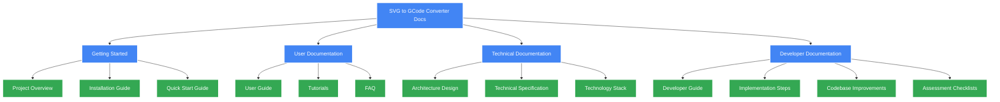

# SVG to GCode Converter Documentation

Welcome to the official documentation for the SVG to GCode Converter, an open-source tool designed to transform SVG vector graphics into GRBL-compatible GCode instructions, with special support for grayscale-to-depth mapping.

## Documentation Structure

### Getting Started
- [Project Overview](project_description.md) - Introduction to the project, its purpose and key features
- [Installation Guide](installation_guide.md) - Step-by-step instructions for installing the application
- [Quick Start Guide](user_guide.md#quick-start) - Get up and running quickly with essential operations

### User Documentation
- [User Guide](user_guide.md) - Comprehensive guide for using the application
- [Tutorials](user_guide.md#tutorials) - Step-by-step guides for common tasks
- [FAQ](user_guide.md#frequently-asked-questions) - Answers to common questions

### Technical Documentation
- [Architecture Design](architecture_design.md) - System architecture, component design, and data flow
- [Technical Specification](technical_specification.md) - Detailed API definitions and algorithms
- [Technology Stack](technology_stack.md) - Languages, frameworks, and libraries used

### Developer Documentation
- [Developer Guide](developer_guide.md) - Guide for developers contributing to the project
- [Implementation Steps](implementation_steps.md) - Step-by-step implementation guidance
- [Codebase Improvements](codebase_improvements.md) - Ongoing improvements and technical debt
- [Assessment Checklists](assessment_checklists.md) - Quality evaluation guides

## View Documentation

### HTML Documentation

This repository includes a tool to generate an HTML version of this documentation with proper rendering of Mermaid diagrams:

```bash
# On Windows
docs/tools/html-generator/generate-docs.bat

# On macOS/Linux
docs/tools/html-generator/generate-docs.sh
```

The generated HTML documentation will be available in the `docs/html` directory. Open `docs/html/index.html` in your browser to view it.

## Documentation Diagram



## Contributing to Documentation

We welcome contributions to improve this documentation. Please follow these guidelines:

1. Use Markdown formatting for consistency
2. Add Mermaid diagrams where visualization would be helpful
3. Keep the language clear and accessible 
4. Follow the established structure
5. Test all internal and external links

To contribute, please submit a pull request with your changes.

## Documentation Updates

All documentation is regularly updated to reflect the latest changes in requirements, architecture, and implementation details. Check the repository for the most up-to-date information. 