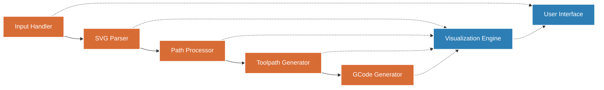
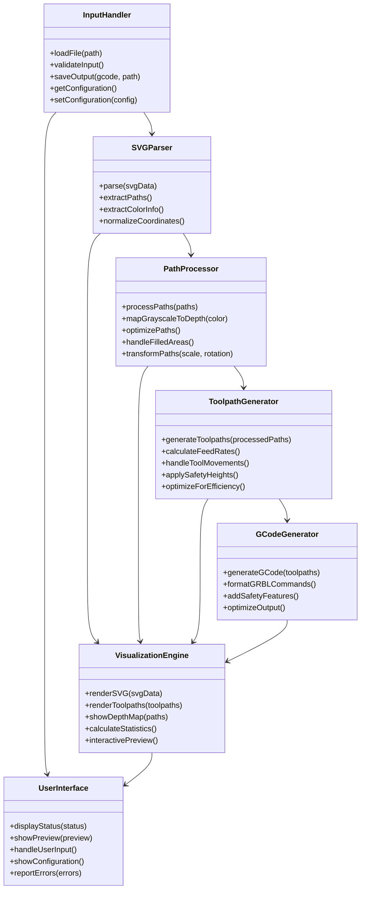
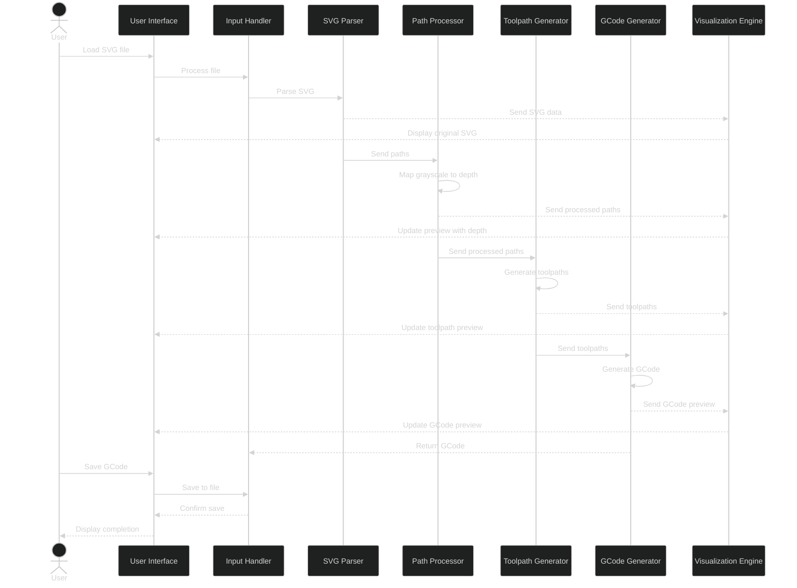
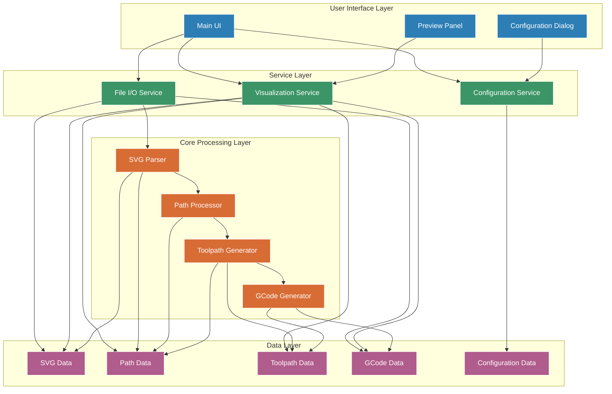
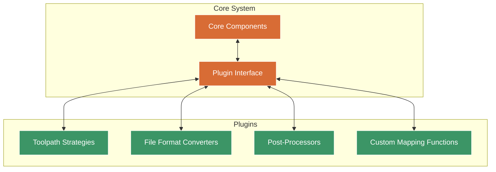
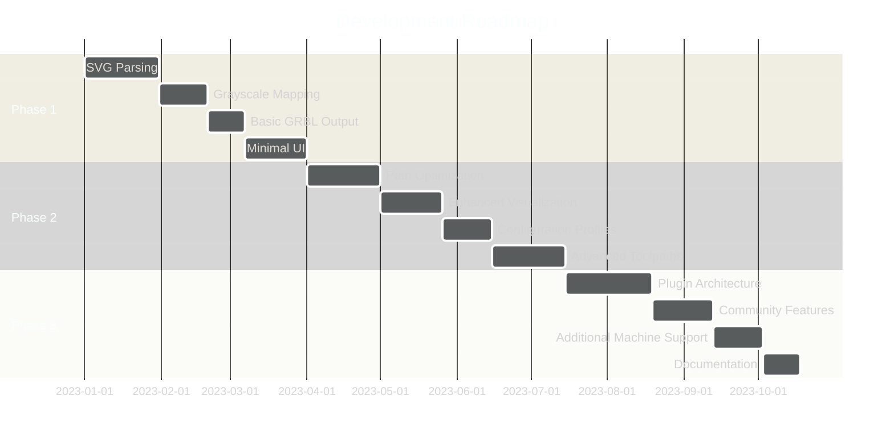

# SVG to GCode Converter - Architecture Design

## System Overview

The SVG to GCode Converter is designed as a standalone desktop application that transforms SVG vector files into GRBL-compatible GCode, using grayscale color information to determine cutting depth. The architecture follows a modular pipeline approach to process the input SVG through several transformation stages before producing the final GCode output.

### Component Pipeline Diagram

## Core Components

### 1. Input Handler
**Purpose**: Manages file input/output operations and validates input files.

**Responsibilities**:
- File loading and validation
- Input format verification
- Configuration parameter management
- Output file management

**Technical Approach**:
- Local file system access
- SVG format validation
- Configuration persistence

(See [Input Handler API](technical_specification.md#1-input-handler-api))

### 2. SVG Parser
**Purpose**: Extracts vector path and color information from SVG files.

**Responsibilities**:
- Parse standard SVG format
- Extract path elements (lines, curves, polygons)
- Process grayscale color attributes
- Normalize coordinate systems
- Handle transformations and groupings

**Technical Approach**:
- Leverage an open-source SVG parsing library (See [Technology Stack](technology_stack.md#svg-processing))
- Create an intermediate representation of paths and attributes
- Normalize to a common coordinate system

(See [SVG Parser API](technical_specification.md#2-svg-parser-api))

### 3. Path Processor
**Purpose**: Converts SVG paths into machining-ready paths with associated depth information.

**Responsibilities**:
- Convert SVG paths to simplified path segments
- Map grayscale values to Z-axis depth values
- Apply scaling and transformations
- Optimize paths for machining efficiency
- Handle filled areas and convert to appropriate toolpaths

**Technical Approach**:
- Path simplification algorithms (See [Path Simplification Algorithm](technical_specification.md#3-svg-path-simplification-algorithm))
- Grayscale mapping functions (linear, custom curves) (See [Grayscale to Depth Mapping Algorithm](technical_specification.md#1-grayscale-to-depth-mapping-algorithm))
- Path combination and optimization (See [Path Optimization Algorithm](technical_specification.md#2-path-optimization-algorithm))

(See [Path Processor API](technical_specification.md#3-path-processor-api))

### 4. Toolpath Generator
**Purpose**: Creates machine-specific toolpaths with appropriate cutting parameters.

**Responsibilities**:
- Generate efficient cutting strategies
- Calculate appropriate feed rates
- Handle tool entry and exit movements
- Apply safety height transitions
- Consider machine constraints

**Technical Approach**:
- Path to toolpath conversion algorithms (See [Toolpath Generation Algorithm](technical_specification.md#4-toolpath-generation-algorithm))
- Cutting strategy implementation (contour, pocket, etc.)
- Machine constraints management
- Collision avoidance

(See [Toolpath Generator API](technical_specification.md#4-toolpath-generator-api))

### 5. GCode Generator
**Purpose**: Produces GRBL-compatible GCode from toolpaths.

**Responsibilities**:
- Format toolpaths as GCode commands
- Add machine-specific commands and parameters
- Optimize for GRBL controller
- Include appropriate headers and safety features
- Format output file

**Technical Approach**:
- GRBL-specific command generation (See [GRBL-Specific GCode Generation](technical_specification.md#5-grbl-specific-gcode-generation))
- GCode optimization techniques
- Proper command sequencing

(See [GCode Generator API](technical_specification.md#5-gcode-generator-api))

### 6. Visualization Engine
**Purpose**: Provides visual feedback throughout the conversion process.

**Responsibilities**:
- Render SVG input
- Visualize resulting toolpaths
- Show depth mapping with color coding
- Display estimated cutting time and path statistics
- Support interactive preview

**Technical Approach**:
- 2D rendering engine (See [Technology Stack](technology_stack.md#frontend))
- Color-coded toolpath visualization
- Support for zooming and panning

(See [Visualization API](technical_specification.md#6-visualization-api))

### 7. User Interface
**Purpose**: Provides user interaction for file handling, parameter configuration, and visualization.

**Responsibilities**:
- Present intuitive controls for all operations
- Display conversion status and results
- Allow parameter adjustment
- Support configuration profiles
- Handle error reporting

**Technical Approach**:
- Modern desktop UI framework (See [Technology Stack](technology_stack.md#frontend))
- Responsive design for different screen sizes
- Intuitive control layout
- Streamlined workflow

(See [User Interface Section in Technical Specification](technical_specification.md#ui-specifications) - *Note: Section needs to be added in Tech Spec*)

### Component Class Diagram

## Data Flow

1. **Input Stage**:
   - User loads SVG file through UI
   - Input Handler validates and processes the file
   - Configuration parameters are applied
   
2. **Processing Stage**:
   - SVG Parser extracts vector paths and attributes
   - Path Processor converts to machine-ready paths with depth
   - Toolpath Generator creates optimized toolpaths
   - Each stage reports progress to UI
   
3. **Output Stage**:
   - GCode Generator creates GRBL-compatible code
   - Visualization Engine renders preview
   - Output statistics are calculated
   - GCode is saved to user-specified location

### Data Flow Diagram

## Technical Architecture

### Application Structure
- Standalone desktop application
- Cross-platform compatibility (optional)
- Completely offline operation
- Local file system access only

### Development Approach
- Modular component design
- Clear interfaces between components
- Open-source libraries for SVG parsing and visualization
- Unit tests for core algorithms

### Component Architecture Diagram

### Libraries and Dependencies
- SVG parsing library (e.g., SVG.js, SVGO)
- 2D graphics library for visualization
- Desktop UI framework
- File system access library
- Geometry processing libraries

(See [Technology Stack](technology_stack.md) for full list)

### Performance Considerations
- Efficient path optimization algorithms
- Memory management for large SVG files
- Progressive processing for responsive UI
- Background processing for compute-intensive tasks

## Extensibility

The architecture is designed to be extensible in several ways:

1. **Plugin System**: Support for future extensions through a plugin architecture
   - Custom toolpath strategies
   - Additional file format support
   - Machine-specific post-processors

2. **Configuration Profiles**: Support for saving and loading machine-specific configurations
   - Tool libraries
   - Material settings
   - Machine constraints

3. **Custom Mapping Functions**: Extensible grayscale-to-depth mapping mechanisms
   - Linear mapping
   - Custom curves
   - Lookup tables

### Plugin Architecture Diagram

## Development Roadmap

### Phase 1: Core Functionality
- Basic SVG parsing
- Simple grayscale-to-depth mapping
- GRBL GCode generation
- Minimal UI

### Phase 2: Advanced Features
- Path optimization
- Enhanced visualization
- Configuration profiles
- Advanced toolpath strategies

### Phase 3: Community Features
- Plugin architecture
- Community sharing
- Additional machine support
- Enhanced documentation

### Roadmap Timeline

## Deployment Considerations

### Installation
- Simple installer for hobbyist users
- Minimal dependencies
- Small footprint

### Updates
- Local update mechanism
- Version compatibility
- Configuration migration

### System Requirements
- Standard desktop/laptop
- Local file system access
- No internet requirement
- Minimal resource usage 