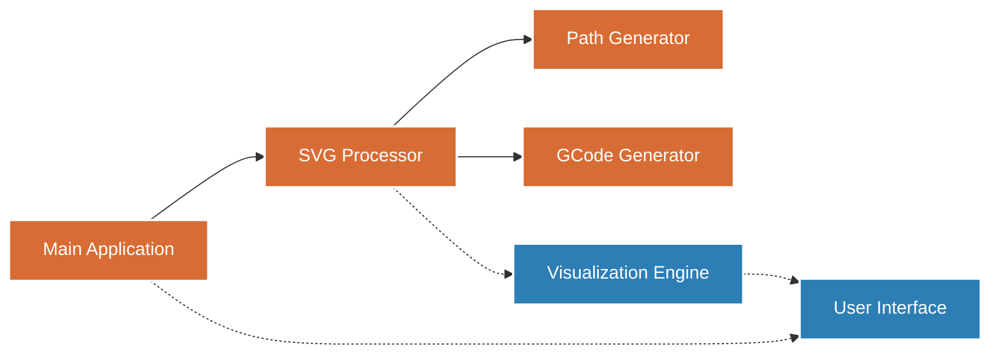
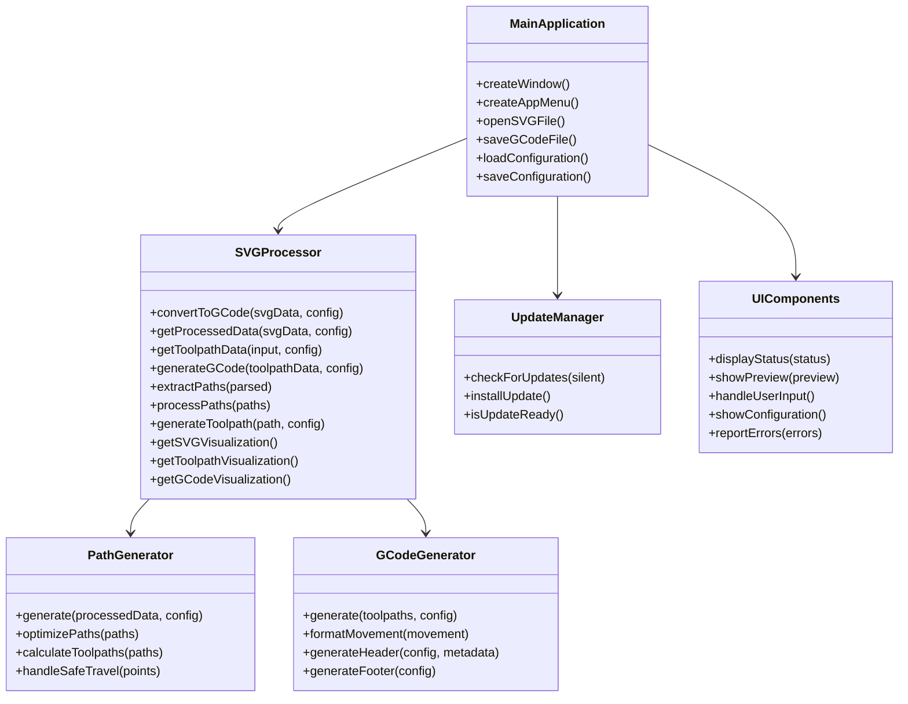
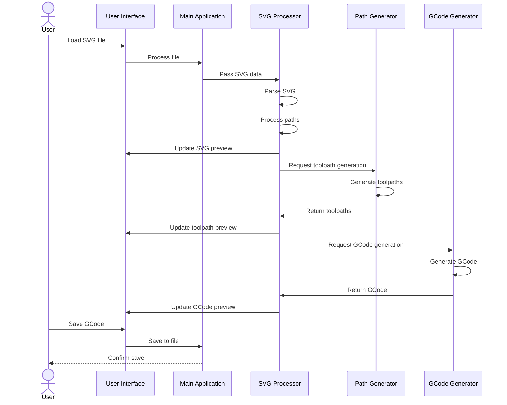

# SVG to GCode Converter - Architecture Design

## System Overview

The SVG to GCode Converter is designed as a standalone desktop application that transforms SVG vector files into GRBL-compatible GCode, using grayscale color information to determine cutting depth. The architecture uses a centralized processing approach with a main SVG Processor component that coordinates several specialized modules.

### Component Design Diagram



## Core Components

### 1. Main Application (`index.js`)
**Purpose**: Serves as the application entry point and handles UI integration.

**Responsibilities**:
- Electron app initialization
- Window management
- Menu creation
- File dialog operations
- Update checking
- Configuration loading/saving

**Technical Approach**:
- Electron-based desktop application
- Local file system access
- Configuration persistence

### 2. SVG Processor (`svg-processor.js`)
**Purpose**: Central component that manages SVG parsing, processing, and coordination with other modules.

**Responsibilities**:
- Parse SVG files and extract path data
- Process grayscale color attributes
- Convert vector paths to machine-ready paths
- Coordinate toolpath generation
- Provide visualization data
- Orchestrate the GCode generation process

**Technical Approach**:
- Utilizes svg-parser and other SVG libraries
- Implements grayscale to depth mapping
- Coordinates with Path Generator and GCode Generator

### 3. Path Generator (`toolpath/path-generator.js`)
**Purpose**: Converts processed paths to optimized toolpaths.

**Responsibilities**:
- Generate optimized machine toolpaths
- Handle path optimization and efficiency
- Apply machine-specific constraints
- Support different cutting strategies

**Technical Approach**:
- Path optimization algorithms
- Cutting strategy implementations
- Machine constraint management

### 4. GCode Generator (`gcode/gcode-generator.js`)
**Purpose**: Produces GRBL-compatible GCode from toolpaths.

**Responsibilities**:
- Format toolpaths as GCode commands
- Add machine-specific commands and parameters
- Optimize for GRBL controller
- Include appropriate headers and safety features
- Format output file

**Technical Approach**:
- GRBL-specific command generation
- GCode optimization techniques
- Proper command sequencing

### 5. Visualization Engine
**Purpose**: Provides visual feedback throughout the conversion process.

**Responsibilities**:
- Render SVG input
- Visualize resulting toolpaths
- Show depth mapping with color coding
- Display estimated cutting time and path statistics

**Technical Approach**:
- Visualization methods in SVG Processor
- SVG-based rendering for preview
- Color-coded depth visualization

### 6. User Interface
**Purpose**: Provides user interaction for file handling, parameter configuration, and visualization.

**Responsibilities**:
- Present controls for file operations
- Display conversion status and results
- Allow parameter adjustment
- Support configuration profiles
- Handle error reporting

**Technical Approach**:
- Electron-based UI
- HTML/CSS/JavaScript interface
- Integration with main application

### Component Class Structure



## Additional Components

### Circle and Arc Fix Utilities

The implementation includes specific utilities for handling SVG circles and arcs:
- `circle-arc-fix.js`: Algorithms for correcting circle and arc representations
- `apply-circle-arc-fix.js`: Application of the fixing algorithms

These components ensure accurate conversion of circular elements from SVG to GCode.

### Update Manager (`update-manager.js`)

The application includes an update management system that:
- Checks for application updates
- Manages the update download and installation process
- Integrates with Electron's update mechanisms

## Data Flow

### Current Data Flow



## Technical Architecture

### Application Structure
- Standalone desktop application (Electron)
- Local file system access
- Completely offline operation
- SVG Processor as central coordination component

### Directory Structure

```
/svg-to-gcode-converter
├── src/
│   ├── index.js               # Main application entry point
│   ├── svg-processor.js       # Central processing component
│   ├── preload.js             # Electron preload script
│   ├── update-manager.js      # Update management
│   ├── parser/                # SVG parsing modules
│   ├── processor/             # Processing utilities
│   ├── toolpath/              # Toolpath generation
│   ├── gcode/                 # GCode generation
│   ├── visualization/         # Visualization utilities
│   ├── ui/                    # User interface components
│   ├── models/                # Data models
│   └── utils/                 # Utility functions
├── tests/                     # Test files
├── docs/                      # Documentation
├── examples/                  # Example SVG files
├── output/                    # Default output directory
└── debug_output/              # Debug files and visualizations
```

### Libraries and Dependencies
- Electron for desktop application framework
- svg-parser and related libraries for SVG processing
- JSDOM for DOM manipulation
- Bezier.js for curve manipulation
- ColorConvert for color processing

## Development Roadmap

### Completed Development
- Basic SVG parsing
- Simple grayscale-to-depth mapping
- GRBL GCode generation
- Minimal Electron-based UI
- Circle and arc processing utilities
- Update management system

### Current Priorities
- Code organization and refactoring
- Moving test files to a dedicated tests directory
- Improving the monolithic structure of SVG Processor
- Adding proper documentation

### Future Enhancements
- Enhanced visualization
- Configuration profiles
- Additional machine support
- Enhanced documentation

## Deployment Considerations

### Installation
- Simple installer for hobbyist users
- Minimal dependencies
- Small footprint

### Updates
- Update mechanism through UpdateManager
- Version compatibility checks
- Configuration migration

### System Requirements
- Standard desktop/laptop
- Local file system access
- No internet requirement (except for updates)
- Minimal resource usage 